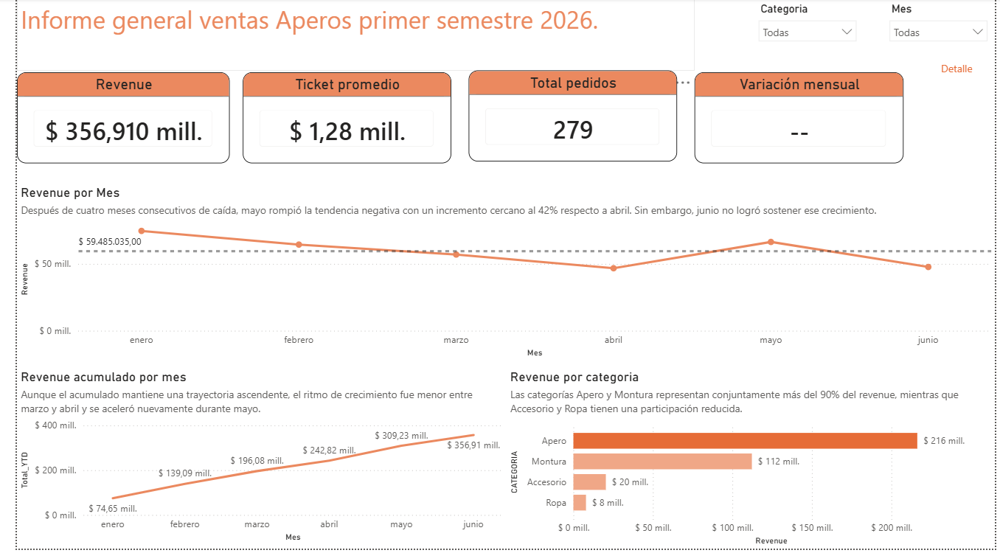
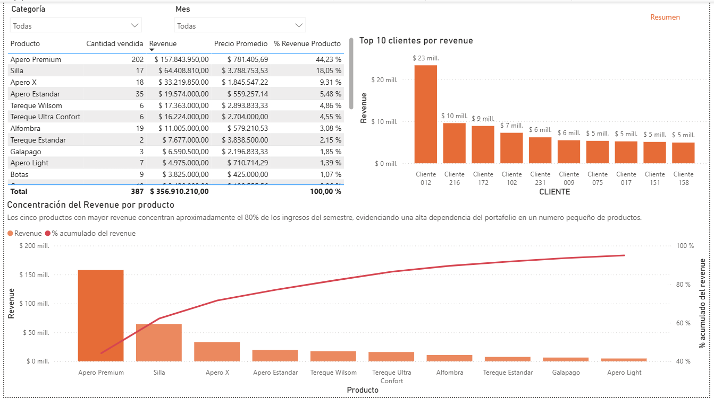

# 📊 Análisis de Ventas | Power BI

## Descripción del proyecto

Este proyecto consiste en el desarrollo de un dashboard interactivo en **Power BI** para analizar el desempeño comercial de una empresa durante el **primer semestre de 2026**.

El trabajo comenzó con una base de datos que presentaba inconsistencias en la información de productos y clientes. Para garantizar un análisis confiable, se realizó un proceso de limpieza, estandarización y transformación de los datos antes de construir el modelo analítico y el dashboard.

> **Nota:** Los datos publicados en este repositorio fueron **anonimizados** para proteger la información de la empresa y de sus clientes. La metodología, el proceso de análisis y los resultados corresponden al proyecto original.

---

# Objetivos

- Mejorar la calidad de la información comercial.
- Estandarizar los productos para facilitar el análisis.
- Construir indicadores clave de negocio (KPIs).
- Desarrollar un dashboard interactivo para apoyar la toma de decisiones.

---

# Datos del proyecto

- **Periodo analizado:** Primer semestre de 2026
- **Registros analizados:** 345
- **Productos originales:** 44
- **Productos estandarizados:** 25

---

# Herramientas utilizadas

- Power BI
- Power Query
- DAX
- Excel

---

# Proceso de desarrollo

### 1. Limpieza de datos

Se revisó la base de ventas para identificar inconsistencias en clientes, productos y estructura de la información.

---

### 2. Estandarización

Uno de los principales problemas encontrados fue la existencia de múltiples nombres para un mismo producto.

Se consolidaron **44 referencias** en **25 productos estandarizados**, permitiendo realizar análisis más consistentes.

---

### 3. Transformación de datos

Mediante **Power Query** se preparó la información para el análisis:

- Corrección de nombres
- Creación de categorías
- Conversión de tipos de datos
- Preparación del modelo

---

### 4. Modelado

Se desarrolló un modelo de datos que permitió calcular indicadores comerciales mediante **DAX**.

---

### 5. Dashboard

Se diseñó un dashboard de **2 páginas** orientado a facilitar el seguimiento del desempeño comercial.

---

# KPIs desarrollados

- Revenue Total
- Ticket Promedio
- Total de Pedidos
- Variación mensual de ventas (%)

---

# Dashboard

## Página 1



---

## Página 2



---

# Principales habilidades demostradas

Este proyecto evidencia experiencia práctica en:

- Limpieza de datos
- Estandarización de datos
- Power Query
- Modelado de datos
- DAX
- Power BI
- Visualización de datos
- Desarrollo de KPIs
- Business Intelligence
- Análisis comercial

---

# Estructura del repositorio

```
sales-analysis-powerbi
│
├── README.md
├── dashboard
│   └── Sales_Performance_Analysis.pbix
├── data
│   └── Ventas_aperos_2026_ANONIMIZADO_PowerBI.xlsx
└── images
    ├── dashboard_1.png
    └── dashboard_2.png
